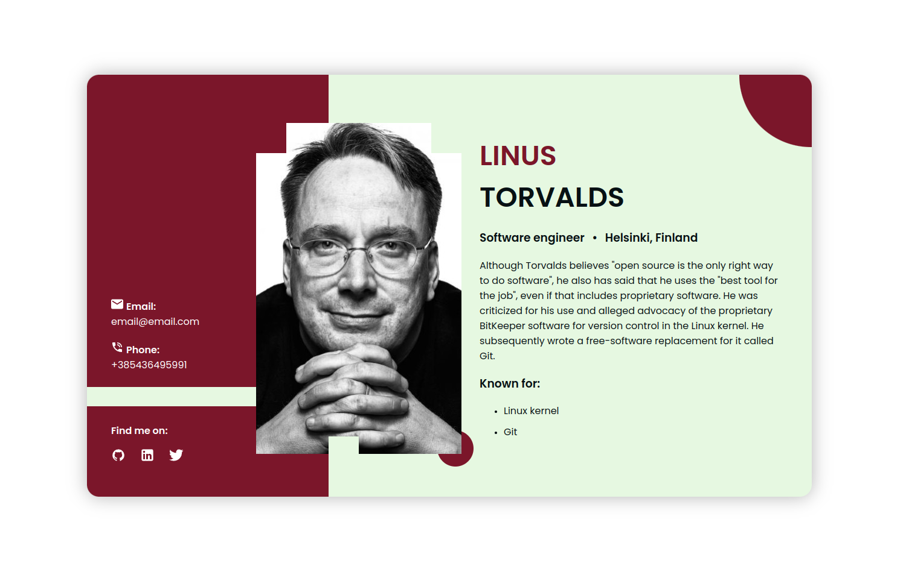

# Business Card Project

## Project brief

Craft a dynamic digital **Business Card** tailored for the modern developer. It's not just an ordinary card, but a vibrant reflection of you. Set the stage for your digital presence.

### Requirements

- Create a full-page background with a centered card layout.
- Add a user contact section on the left of the card with email, phone, and clickable social icons.
- Add a user image in the center of the card.
- Add a user info section on the right of the card with name, position, location, description, and technologies.
- Implement absolute-positioned shapes to improve the layout.
- Enhance user experience with animations, such as image-loading skeleton animation or fade-in effects.
